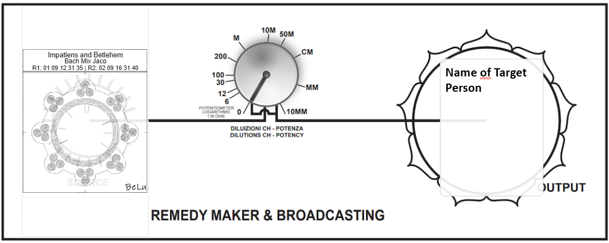

# Remedy Maker



A simple web-based application for creating and managing remedy cards with a timer-based interface. Built with HTML, CSS, and JavaScript, it provides a minimalistic UI for navigating remedy cards and controlling a timer, suitable for radionic or energy work applications.

## Features

- **Timer Control**: Start/pause a timer with a configurable duration (default 10 seconds).
- **Navigation**: Move between remedy cards using "Previous" and "Next" buttons.
- **Card Display**: Shows the current card number and total number of cards (e.g., "1/1").
- **Responsive Design**: Clean, emoji-enhanced interface with a focus on usability.
- **Client-Side**: Runs entirely in the browser with no server-side dependencies.

## Requirements

- A modern web browser (Chrome, Firefox, Safari, Edge, etc.).
- JavaScript must be enabled for functionality.
- No additional dependencies or server setup required.

## Installation

1. Clone the repository:
   ```bash
   git clone https://github.com/yourusername/remedy-maker.git
   cd remedy-maker
   ```

2. Open the `Remedy-Maker-Index.html` file in a web browser:
   - Double-click the file, or
   - Serve it using a local web server (e.g., with Python):
     ```bash
     python -m http.server 8000
     ```
     Then navigate to `http://localhost:8000/Remedy-Maker-Index.html`.

## Usage

1. **Open the Application**: Load `Remedy-Maker-Index.html` in your browser.
2. **Control the Timer**:
   - Click the play/pause button (⏸️) to start or pause the timer.
   - The timer displays the remaining time (default: 10 seconds).
3. **Navigate Cards**:
   - Use the "Previous" (⏮️) and "Next" (⏭️) buttons to cycle through remedy cards.
   - The current card number and total cards are displayed (e.g., "1/1").
4. **Customize**: Modify the HTML/JavaScript to add remedy card content or adjust timer settings as needed.

## File Structure

- `Remedy-Maker-Index.html`: The main HTML file containing the application (HTML, CSS, and JavaScript).
- No additional files are required, as all functionality is embedded.

## Notes

- The application is lightweight and runs entirely client-side.
- The timer defaults to 10 seconds but can be customized by editing the JavaScript in the HTML file.
- The card navigation system assumes a single card by default ("1/1"); additional cards can be added by extending the JavaScript logic.
- The interface uses emoji icons for a modern, intuitive user experience.
- No export functionality is included in the provided HTML, but it can be extended to support saving or exporting remedy data.

## Contributing

Contributions are welcome! Please submit a pull request or open an issue for bug reports, feature requests, or improvements.

1. Fork the repository.
2. Create a new branch (`git checkout -b feature/your-feature`).
3. Commit your changes (`git commit -m "Add your feature"`).
4. Push to the branch (`git push origin feature/your-feature`).
5. Open a pull request.

## License

This project is licensed under the MIT License. See the `LICENSE` file for details.

## Acknowledgments

- Built with HTML, CSS, and JavaScript for a lightweight, client-side experience.
- Inspired by radionic and energy work tools for remedy creation.
- Thanks to the open-source community for browser technologies enabling this application.
